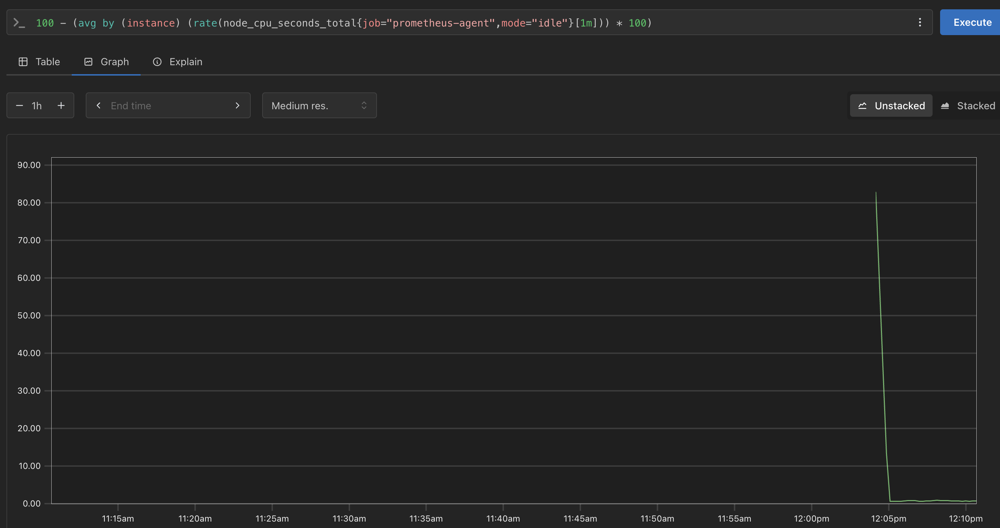

# jenkins
personal project to set a dind jenkins server and run some observability

### build jenkins with command

create a network
````
docker network create jenkins
````

```
docker run --name jenkins-blueocean --restart=on-failure --detach \
  --network jenkins --env DOCKER_HOST=tcp://docker:2376 \
  --env DOCKER_CERT_PATH=/certs/client --env DOCKER_TLS_VERIFY=1 \
  --publish 8080:8080 --publish 50000:50000 \
  --volume jenkins-data:/var/jenkins_home \
  --volume jenkins-docker-certs:/certs/client:ro \
  jenkins:v1
```
grab the initial password to configure the jenkins

```
docker exec jenkins-blueocean cat /var/jenkins_home/secrets/initialAdminPassword

```

To run docker commands, we will need to use Docker-in-Docker. 

```
docker run --name jenkins-docker --rm --detach \
  --privileged --network jenkins --network-alias docker \
  --env DOCKER_TLS_CERTDIR=/certs \
  --volume jenkins-docker-certs:/certs/client \
  --volume jenkins-data:/var/jenkins_home \
  --publish 2376:2376 \
  docker:dind --storage-driver overlay2
```


more explanation: 

https://stackoverflow.com/questions/47709208/how-to-find-docker-host-uri-to-be-used-in-jenkins-docker-plugin

https://www.jenkins.io/doc/book/installing/docker/

### build prometheus agent

```
docker build -t prometheus-agent:v1 -f Dockerfile-Prometheus .
docker run -d --name prometheus-agent --network jenkins -p 9100:9100 prometheus-agent:v1
```

### Compose Prometheus/grafana Up

these two containers are already pointing to network jenkins

```
docker compose up -d
```

you can access prometheus and UI's using:
Prometheus - http://localhost:9090  
Grafana - http://localhost:3000 (admin/admin first login)

as test purpose, you can access the prometheus-agent, run apt install stress and run a stress on the machine while doing the query on prometheus

prometheus query:
````
100 - (avg by (instance) (rate(node_cpu_seconds_total{job="prometheus-agent",mode="idle"}[1m])) * 100)
````


Grafana is set on docker-compose file with a pre-built dashboard, already collecting data from the prometheus, which is also collecting data from the prometheus-agent.


### work in progress
At the end of the pipeline there is a python script that will download the rendered dashboard
and convert to pdf
